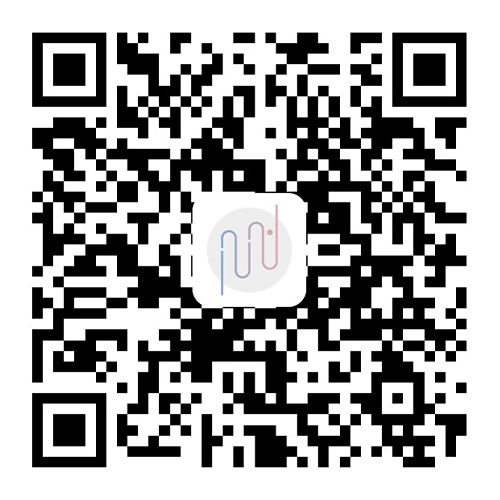

## 关于

这里是由[水八口](https://shuiba.co)设计并编写的[Bitcron](https://bitcron.com)主题集合，欢迎★。

| 序号 | 主题说明 | 发布时间 | 价格
| --- | --- | --- | --- |
| 1 | [「你好呀」(Hello)](https://blog.shuiba.co/bitcron-theme-hello) | 2017-06-09 | ¥50
| 2 | [「庸」(Ordinary)](https://blog.shuiba.co/bitcron-theme-ordinary) | 2017-07-21 | ¥60
| 3 | [「日记」(Diary)](https://blog.shuiba.co/bitcron-theme-diary) | 2017-07-24 | ¥40
| 4 | [「它布」(Tab)](https://blog.shuiba.co/bitcron-theme-tab) | 2017-07-26 | ¥60
| 5 | [「墨」(Ink)](https://blog.shuiba.co/bitcron-theme-ink) | 2017-07-31 | ¥70
| 6 | [「黑白」(Monochrome)](https://blog.shuiba.co/bitcron-theme-monochrome) | 2017-09-20 | ¥60
| 7 | [「淡泊」(Light)](https://blog.shuiba.co/bitcron-theme-light) | 2017-10-24 | ¥60
| 8 | [「入灰」(inGrey)](https://blog.shuiba.co/bitcron-theme-ingrey) | 2017-11-13 | ¥70
| 9 | [「方」(Square)](https://blog.shuiba.co/bitcron-theme-square) | 2017-12-13 | ¥60

## 付费/捐赠（支付宝）

