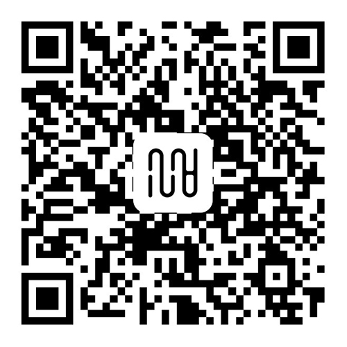

`!!` 2021年，Bitcron进化至FarBox 2.0，以下主题的使用需要手动调整细节。

## 关于

这里是由[水八口](https://shuiba.co)原创设计并编写的[Bitcron](https://bitcron.com)主题集合，欢迎查看学习、购买使用。

| 序号 | 主题说明 | 发布时间 | 价格
| --- | --- | --- | --- |
| 01 | [「你好呀」(Hello)](https://blog.shuiba.co/bitcron-theme-hello) | 2017-06-09 | -
| 02 | [「庸」(Ordinary)](https://blog.shuiba.co/bitcron-theme-ordinary) | 2017-07-21 | ¥60
| 03 | [「日记」(Diary)](https://blog.shuiba.co/bitcron-theme-diary) | 2017-07-24 | ¥40
| 04 | [「它布」(Tab)](https://blog.shuiba.co/bitcron-theme-tab) | 2017-07-26 | ¥60
| 05 | [「墨」(Ink)](https://blog.shuiba.co/bitcron-theme-ink) | 2017-07-31 | ¥70
| 06 | [「黑白」(Monochrome)](https://blog.shuiba.co/bitcron-theme-monochrome) | 2017-09-20 | ¥60
| 07 | [「淡泊」(Light)](https://blog.shuiba.co/bitcron-theme-light) | 2017-10-24 | ¥60
| 08 | [「入灰」(inGrey)](https://blog.shuiba.co/bitcron-theme-ingrey) | 2017-11-13 | ¥70
| 09 | [「方」(Square)](https://blog.shuiba.co/bitcron-theme-square) | 2017-12-13 | ¥60
| 10 | [「卡片」(Card)](https://blog.shuiba.co/bitcron-theme-card) | 2018-03-03 | ¥70
| 11 | [「界」(Border)](https://blog.shuiba.co/bitcron-theme-border) | 2019-04-23 | ¥80
| 12 | [「帧」(Frame)](https://blog.shuiba.co/bitcron-theme-frame) | 2020-06-11 | ¥80

## 付费/捐赠

支付宝

## 版权声明

本人水八口/Shuibaco原创的Bitcron主题，包含发布在GitHub上的开源代码采用以下版权许可：

- 按照标注价格进行售卖；
- 一次购买，终生使用；
- 购买后允许应用至私人所有的任意网站，但不得分发复制给除购买者之外的其他人；
- 购买后允许商用，但不得直接售卖全部或部分源码；
- 购买后允许按照个人喜好修改，包括移植到其他平台，但不得售卖；
- 使用时必须署名`水八口`或`Shuibaco`；
- 本人不保证所有文档的时效性和稳定性；
- 若被人恶意使用产生不良影响，本人不承担任何责任。

所有源码都在GitHub上开源，欢迎查看学习。如果决定使用主题，请务必付费支持原创作者。本人享有最终解释权。